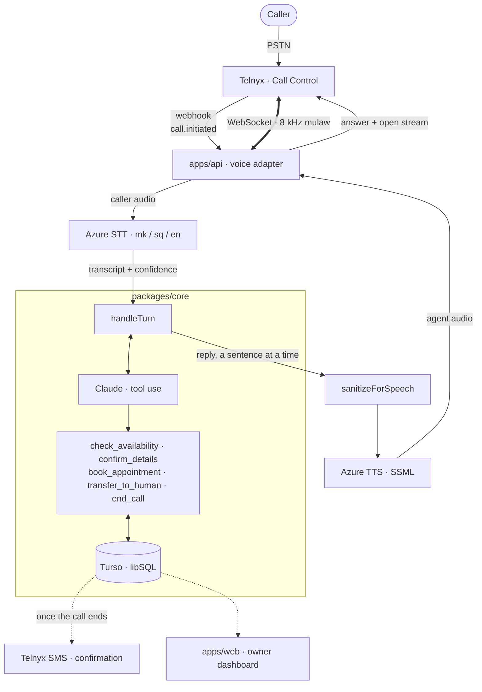
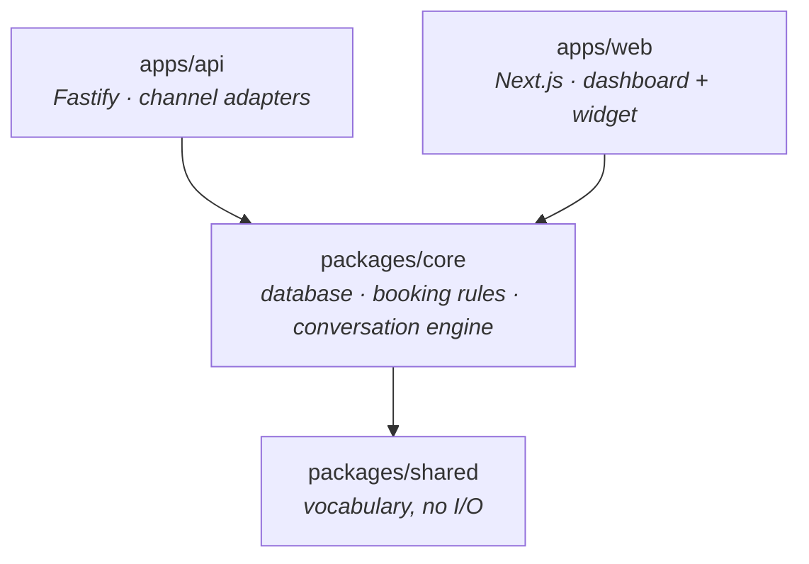

<p align="center">
  
</p>

<h1 align="center">Frontly</h1>

<p align="center">
  An AI receptionist that answers the phone in Macedonian, checks real availability, and books the appointment.
</p>

<p align="center">
  <a href=".github/workflows/ci.yml"></a>
  
  
  
  
  
</p>

---

## Call it

<h3 align="center">
  <a href="tel:+16193497599">+1&nbsp;619&nbsp;349&nbsp;7599</a>
</h3>

<p align="center">
  <sub>Live right now. Answered by the code in this repository.</sub>
</p>

This is a real number, answered by the software in this repository. Ring it and
speak **Macedonian** — say *„Сакам да закажам преглед"* (I'd like to book a
check-up) and it will offer you real free times from a real calendar, read your
phone number back digit by digit, wait for you to confirm, and write the booking
to the database. Albanian and English work too.

It answers a US number because North Macedonia has no +389 inventory available
to the account yet; that is a procurement step, not an engineering one.

---

## Demo video

<!--
  Replace this block with the video.

  YouTube / Vimeo — a thumbnail that links to the video (GitHub strips iframes,
  so a linked image is the way an embed is done here):

  <p align="center">
    <a href="VIDEO_URL">
      
    </a>
  </p>

  Or an MP4 committed to the repo, which GitHub plays inline:

  https://github.com/0kuculov/frontly/assets/…/demo.mp4
-->

<p align="center">
  <strong>Demo video — coming</strong><br>
  <sub>A booking taken end to end by phone, in Macedonian, with the owner's dashboard alongside.</sub>
</p>

---

## The problem

A dental clinic, a hair salon or a garage has one or two people, and both of
them are with a customer for most of the working day. The phone rings, nobody
can reach it, and the caller does not leave a voicemail — they ring the next
business on the list. The booking is lost before anyone knows it existed.

Every general-purpose answering service solves this in English. None of them
speak Macedonian well enough to take a booking over an 8 kHz phone line, and a
receptionist who mishears a name or a phone number is worse than no receptionist
at all.

Frontly answers on the first ring, in the caller's own language, and only ever
offers times that are genuinely free.

---

## Architecture

### The call path



`packages/core` is inside the box on purpose: it has no idea a telephone is
involved. Three details in that path are load-bearing.

The answer command and the media-stream parameters go out in **one** round
trip, because answering first and opening the stream second leaves the caller
in silence while the second request is in flight. The socket carries a 20 ms
frame every 20 ms for the whole call, silence included — a simulation that
simply stops sending between turns is not a phone call, and Azure's
end-of-phrase timer measures silence *in the audio it receives*. And the reply
is synthesized **a sentence at a time**, so sentence two is still generating
while sentence one is already playing.

### The package boundary



Dependencies point one way and nothing in `packages/` may import from `apps/`.
The engine has no idea whether it is talking to a telephone or a browser: it
receives text and returns text, and every channel-specific concern — audio
framing, barge-in, webhook signatures — lives in an adapter.

That constraint was tested rather than asserted. Adding the web chat channel
took **one adapter file in `apps/api` and zero lines in `packages/core`**. The
prompt, the tools, the booking rules and the confirmation gate all arrived for
free, and `confirm_details` fired correctly on chat with no chat-specific code.
When the API needed migrations in a test, the fix was to export `runMigrations`
from core rather than add Drizzle to the API.

---

## Decisions worth reading about

These are the four that changed what shipped. Each was measured, and two of them
disproved something I believed at the time.

### The speech phrase list made recognition worse

A receptionist for one clinic hears a tiny vocabulary — three services, two
dentists, the days of the week. Biasing the speech recogniser toward those
phrases is so obviously right that it went in without measurement.

It was wrong. A 119-phrase list **truncated recognition at the first list entry
it matched**. The greeting came back as *„Добар ден."* — an entry in the list —
at confidence **0.19 against 0.83 with no list at all**, and the same on three
other utterances. The sentence *„Добар ден, сакам да закажам стоматолошки
преглед"* was arriving as two separate turns, which had been blamed on
segmentation for a week; with the list off it is one turn at confidence 0.88.

Worse, confidence does not catch it. The truncated booking sentence scored
**0.87 against a correct 0.88** — butchered text, healthy score — so every
low-confidence defence in the system is blind to this failure mode.

The full grid is still runnable (`pnpm --filter @frontly/api sweep:phrases`).
Nothing ever beat the baseline: the best any configuration managed was **+0.00**,
identical text at identical confidence. Short entries were the poison — the 102
entries of one or two words cost −0.58 to −0.63 on their own, while the 17 of
three or more words were harmless and useless. The safe configurations are
worthless and the substantial ones are destructive, so the list is off.

### Segmentation timeout and latency are the same dial

Azure ends a phrase after **500 ms** of silence by default. That is shorter than
the pause a person takes while working out which day suits them, so the agent
answered half-finished sentences and then talked over the rest.

Raising it fixes the interruptions and costs exactly what it buys: the agent
cannot begin thinking until the recogniser has waited that long. **900 ms of
silence tolerance is 900 ms before the first token is even requested.** There is
no clever way out — fewer interruptions and faster replies are one dial with two
ends, and the only honest thing to do is put it in the business's own config so
it can be tuned by ear on a real line without a redeploy
(`pnpm --filter @frontly/api tune:speech --silence 900`).

Two footnotes that cost time to learn. `Speech_SegmentationSilenceTimeoutMs` is
only honoured under `Speech_SegmentationStrategy = "Time"`; leave the strategy at
its default and the timeout is silently advisory. And the call simulator
**cannot measure this tradeoff at all** — 400 ms and 900 ms produce identical
end-to-end figures there, because injected TTS audio carries its own trailing
silence and the timer expires before the last frame is written. Only a real call
has a real pause in it.

### A Macedonian SMS costs 70 characters, not 160

Cyrillic is not in GSM-7, so the whole message becomes UCS-2 and a single SMS
part is **70 characters**. This is not theoretical: the first reminder template
came to **71 characters** with the dentist's name in it and silently billed as
two messages.

The same is true of Albanian — `ë` and lowercase `ç` are outside GSM-7 too — and
that was missed for an entire phase, because the 70-character rule had been
written down for Cyrillic and then applied only to Cyrillic. The Albanian
confirmation was the longest of the three templates at 118 characters. English,
the one language nobody involved speaks natively, was the only one that fit.

The fix was not to shorten the wording, because tuning it to the length of
*„Дентал Охрид"* works for the demo clinic and breaks for the first customer with
a longer name. `confirmationText()` now **composes to fit one part** and degrades
in a defined order — full, then drop the staff name, then drop the weekday —
returning the first form that is a single part. A clinic with a 41-character name
loses the staff name and the weekday automatically and still fits. Measured
saving: **$0.118 per booking**, which is more than the entire carrier cost of the
call that produced it.

### Nothing told the adapter a conversation was over

Heard on a real call: at about 45 seconds the agent wished the caller a nice day,
the line stayed open, and at one minute the silence ladder started asking whether
they were still there. The farewell was ordinary text — there were five tools and
none of them ended a call — so a completed conversation and an abandoned caller
were indistinguishable.

`end_call` is now a tool, and it does **not** hang up: `packages/core` knows
nothing about phones. It sets `state.concluded`, the voice adapter waits a grace
period measured from the end of playback, and chat will simply stop. The
interesting part is the exception it required. The agent is otherwise forbidden
from hanging up on a caller who is audibly present — an earlier version dropped
callers at roughly **ten seconds** on 2 of 4 real calls, because four
low-confidence results in a row reached a cap that called `handOver()`, which
with no transfer route speaks an apology and ends the call. A bad line, an accent
or a noisy room all produce sound we cannot transcribe, and every one of those is
a person waiting. A caller who has just said *„довидување"* is the one case where
the opposite is true, and it is the only case.

---

## What a conversation costs

Measured, not estimated: `pnpm --filter @frontly/api measure:cost` counts tokens,
TTS characters and SMS parts from a real booking conversation, and reads the
**carrier's actual invoice** out of the Telnyx `usage_reports` API rather than
applying a rate card to an assumption.

A booked three-minute Macedonian call:

| | cost | share |
|---|---:|---:|
| Follow-up SMS (2 parts × $0.118 to a MK mobile) | $0.236 | 61% |
| Claude (with prompt caching) | $0.075 | 19% |
| Azure TTS + STT | ~$0.058 | 15% |
| Telnyx — inbound minutes, call control, media streaming | ~$0.020 | 5% |
| **Total** | **$0.389** | |

A call that answers a question without booking is **$0.15**. The SMS, the model
figure and the total are read straight out of the measurement run; the Azure and
Telnyx lines are the remainder split by their recorded shares, so treat those two
as approximate and the rest as counted.

Three things in that table are worth more than the total. **The SMS is the
expensive part**, not the AI and not the phone line — the carrier, the thing that
feels expensive, is 5%. **Prompt caching halves the model cost** ($0.161 without,
$0.075 with). And quoting one Telnyx product would be three times low: a single
call bills across `sip-trunking`, `call-control` and `media-streaming`, each on
its own clock.

One procurement decision came straight out of this. A **+389 toll-free** number
costs **$0.535/min** inbound from a mobile against **$0.07/min** for a +389
*local* number, and every Macedonian customer is on a mobile. Toll-free would be
about $1.60 for a three-minute call — four times the entire current cost of a
booked conversation, carrier included. The pending toll-free request is the
expensive choice.

---

## Measured latency

There are two "time to first audio" numbers in this system and only one of them
is the caller's.

| | value | what it is |
|---|---:|---|
| Caller-facing, simulated | **~1,480 ms** | Last caller frame → first reply frame |
| `toFirstAudioMs` in the logs | ~805 ms | **A floor, not a measurement** |
| Model time to first token | ~2,800 ms | Sonnet, cold; first sentence ~5 ms later |
| Azure finalisation | 608–728 ms | Between the caller stopping and a transcript |
| Cached fixed phrases | ~35 ms | Greeting, fillers, apologies |

The per-turn log line looks like the answer and is not. It is measured from
*after* Azure has finalised, and it is really just the filler firing on schedule
— the filler delay is a constant, so that number is a floor by construction and
says nothing about model speed. Quoting it as the caller's latency would be
wrong by about half.

Two honest caveats. The simulated figure is itself a floor, because injected TTS
audio carries its own trailing silence and a real caller's pause is real time; on
live calls the field records a median around **6 s** over a small sample, and the
mean is dragged to 11 s by one 37-second outlier. And **streaming cannot fix a
slow first token** — 2.8 s to first token with the first sentence 5 ms behind it
means only a faster model, a shorter system prompt, or a cache hit will move the
number. `pnpm --filter @frontly/core bench` prints that split.

The one number that is unambiguously good is the greeting: pre-synthesizing fixed
lines at boot took it from about **800 ms to ~35 ms**.

---

## Running it

```bash
git clone https://github.com/0kuculov/frontly.git
cd frontly
corepack enable            # pnpm 11, pinned in packageManager
pnpm install

cp .env.example .env       # then fill it in — see below
pnpm db:migrate            # creates the schema
pnpm db:seed               # a demo dental clinic in Ohrid, idempotent
pnpm db:create-owner --email you@example.com   # dashboard login, password from stdin

pnpm dev                   # api on :8080, dashboard on :3000
```

`DATABASE_URL=file:./frontly.db` is enough to run everything except the phone:
the engine, the booking rules, the chat widget, the dashboard and the whole test
suite work with no external services. A `file:` URL is refused outright in
production.

To answer a real call you also need `ANTHROPIC_API_KEY`, `AZURE_SPEECH_KEY`,
`AZURE_SPEECH_REGION`, `TELNYX_API_KEY`, `TELNYX_PUBLIC_KEY` and a
`PUBLIC_BASE_URL` the carrier can reach. Every variable is documented with a
comment in `.env.example`. Per-phase secrets are demanded at the point of use
rather than at boot, so a missing SMS credential cannot stop a call being
answered — but in production the voice channel is asserted at startup and the
process refuses to start without it.

```bash
pnpm test          # 296 tests
pnpm typecheck
pnpm build         # what CI and Render run
```

### Measuring things yourself

Every claim above has a script behind it. None of these place a call.

```bash
pnpm --filter @frontly/api verify:telnyx      # does the account match the code?
pnpm --filter @frontly/api verify:azure       # real TTS → STT round trip
pnpm --filter @frontly/api verify:macedonian  # a listening pass over every spoken string
pnpm --filter @frontly/api verify:albanian    # the same for Albanian
pnpm --filter @frontly/api sweep:phrases      # re-measures the phrase-list grid
pnpm --filter @frontly/api bench:latency      # p50/p95 per stage of a turn
pnpm --filter @frontly/api measure:cost       # tokens, TTS chars, SMS parts, real invoice
pnpm --filter @frontly/api probe:concurrency  # finds the ceiling
pnpm --filter @frontly/api simulate:call      # a whole call, no phone involved
```

---

## Status

Deployed and answering a real phone number. Not a product anyone is paying for
yet.

**Working end to end.** Inbound calls in Macedonian, Albanian and English.
Availability against working hours, service duration and per-staff competence.
Double-booking prevented by a partial unique index, verified under real
contention — every caller asks for the same slot, exactly one gets it, and the
loser is told so in conversation. An embeddable chat widget over the same
engine. An owner dashboard with a day rail, transcripts, and manual booking and
cancellation that go through the same functions the phone does. SMS
confirmations, reminders and a daily summary, composed to fit one message part.

**Known weak, honestly.**

- **SMS does not reach Macedonian phones yet.** Proven with a real send: Telnyx
  accepts the message and the destination carrier rejects it with error 40008.
  The alphanumeric sender ID `FRONTLY` needs registering for +389 with the
  carrier — a telecom paperwork step, not a build step. The US long code cannot
  help; it reports `international_outbound: false`.
- **Three concurrent callers, and it is not a code problem.** Azure refuses a
  fourth simultaneous transcription (`websocket error 4429`), reproducibly at
  exactly 3, because every call holds one recogniser open for its whole
  duration. Raising it is a tier change. Below that ceiling the process is
  comfortable: frame pacing p50 9 ms late against a 20 ms budget, and heap ends
  lower than it started.
- **A caller who switches language mid-call becomes untranscribable.** Azure's
  `AtStart` language detection decides once from the opening audio and decodes
  the whole connection that way; English after Macedonian comes back at
  confidence **0.05** as pure garbage. `Continuous` scored 4/4 in testing and is
  deliberately not shipped before the demo, because those clips were clean TTS
  separated by digital silence and nothing there tests a flip mid-sentence on a
  noisy 8 kHz line.
- **Albanian is usable but not equal to Macedonian.** Mean word accuracy 83%,
  language detection 3/3 — but the confidence score is **inert**: every
  utterance returns exactly 0.79, including Macedonian audio transcribed as
  obvious nonsense. The entire low-confidence apology ladder therefore cannot
  fire in Albanian. Proper nouns and dictated digits are the weak line, which is
  precisely what a booking needs.
- **No native speaker has reviewed the Albanian strings.** Every one
  round-trips through TTS and STT intact; that is not the same as sounding right
  to somebody from Tetovo.
- **Single tenant in practice.** Inbound calls route to the only business when
  exactly one exists. Per-business number routing exists in the schema and is
  untested with two.
- **No paying customer, no pilot.** The clinic in the demo is seeded data.

**A note on the CI badge.** This repository is private, so shields.io cannot
read its workflow runs and a live status badge would render as an error for
every reader. The badge above therefore states what CI *runs* — build,
typecheck and the full suite, on every push, defined in
[`.github/workflows/ci.yml`](.github/workflows/ci.yml) — rather than asserting a
result it cannot prove. If the repository is made public, swap it for the live
one:

```html
<a href="https://github.com/0kuculov/frontly/actions/workflows/ci.yml"></a>
```

There is also no licence badge, because there is no `LICENSE` file yet. That is
a decision with consequences — a permissive licence gives away a product being
pitched — and it is not one to make by default.

**Next.** Register the alphanumeric sender for +389 and finish the SMS path.
Provision a +389 *local* number. Move language detection to `Continuous` on the
evidence of a real call rather than a simulation. Put the product in front of
one clinic in Ohrid and find out what breaks.

---

## Repository layout

```
apps/
  api/          Fastify. Telnyx voice + SMS, chat, dashboard API, demo screen.
                Every channel adapter lives here and nowhere else.
  web/          Next.js. Owner dashboard, embeddable widget, landing page,
                and the projector screen used on stage.
packages/
  core/         Database, booking rules, conversation engine. Knows nothing
                about phones or browsers.
  shared/       Vocabulary with no I/O: languages, channels, working hours,
                voice config, environment schema, SMS encoding rules.
```

`CLAUDE.md` in the repository root is the engineering log — every measurement
above, every assumption that turned out to be wrong, and why each decision went
the way it did.

---

<p align="center">
  <sub>Built in North Macedonia. The screenshots stay in Macedonian on purpose.</sub>
</p>
